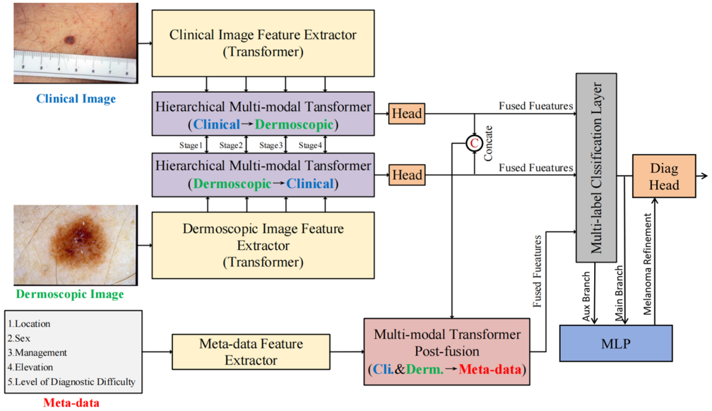

# TFormer-mlp
## License
This project is licensed under the [MIT License](https://github.com/fengrubei/TFormer-mlp/blob/main/LICENSE).

## Introduction
The official implementation of "A Melanoma Diagnosis System Based on Multimodal Images and the Seven-Point Checklist"


## Enviroments
- Windows/Linux both support
- python 3.9
- PyTorch 1.12.1
- torchvision

## Prepare dataset
Please at first download datasets [Derm7pt](https://derm.cs.sfu.ca/Download.html) and then download the pretrained model of swin-tiny on ImageNet-1k from [github](https://github.com/SwinTransformer/storage/releases/download/v1.0.0/swin_tiny_patch4_window7_224.pth). Save the model into the folder "./models/swin_transformer".

## Run details
To train our `TFormer`, run:
```
python train.py --dir_release "your dataset path" --epochs 100 --batch_size 32 --learning_rate 1e-4 --cuda True
```
## License
This repository includes or is based in part on code from zylbuaa (2023),
licensed under the MIT License.
Copyright (c) 2023 zylbuaa

## Acknowledgement
Our code borrows a lot from:
- [Swin-Transformer](https://github.com/microsoft/Swin-Transformer)
- [Derm7pt](https://github.com/jeremykawahara/derm7pt)

